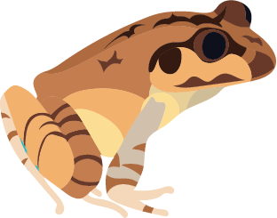

# Australian Frogs
Documentation for *Populating a Continent: Phylogenomics Reveal the Timing of Australian Frog Diversification*  

This project focuses on the phylogenetics and timing of Australian frog diversification. If you're here, you've probably already read the paper. But, in short, we ask three basic questions:  
+ (1) Where did Australia’s frogs originate?  
+ (2) When did they get to Australia?  
+ (3) Who and where are their closest relatives? 

## Directories  
A general guide to the directories and files contained in this repository.  
Each directory includes a summary of the associated files.  

___

### [Alignments](https://github.com/IanGBrennan/Crown_Frogs/tree/main/Alignments)
+ Individual, concatenated, and codon partitioned alignments

___

### [Biogeography](https://github.com/IanGBrennan/Crown_Frogs/tree/main/Biogeography)
+ Input and output files from BioGeoBEARS analyses

___

### [Figures](https://github.com/IanGBrennan/Crown_Frogs/tree/main/Figures)
+ Main text figures, supplementary figures, and components

___

### [Heterotachy](https://github.com/IanGBrennan/Crown_Frogs/tree/main/Heterotachy)
+ IQTREE results of GHOST model under varied H classes

___

### [Manuscript](https://github.com/IanGBrennan/Crown_Frogs/tree/main/Manuscript)
+ All original and revised manuscript files

___

### [Scripts](https://github.com/IanGBrennan/Crown_Frogs/tree/main/Scripts)
+ Code for analyzing data and generating figures

___

### [Trees](https://github.com/IanGBrennan/Crown_Frogs/tree/main/Trees)
+ All resulting tree files

